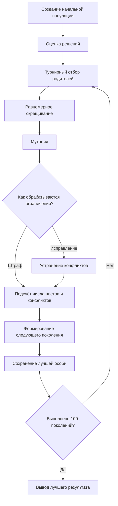
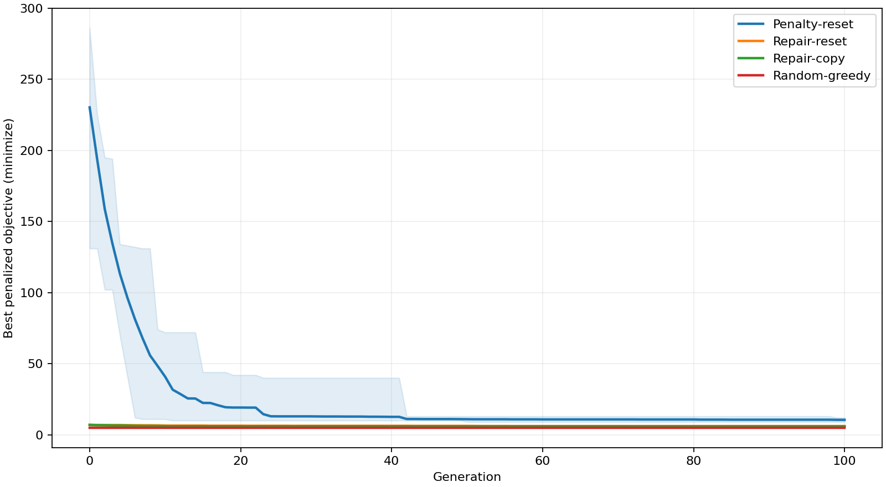
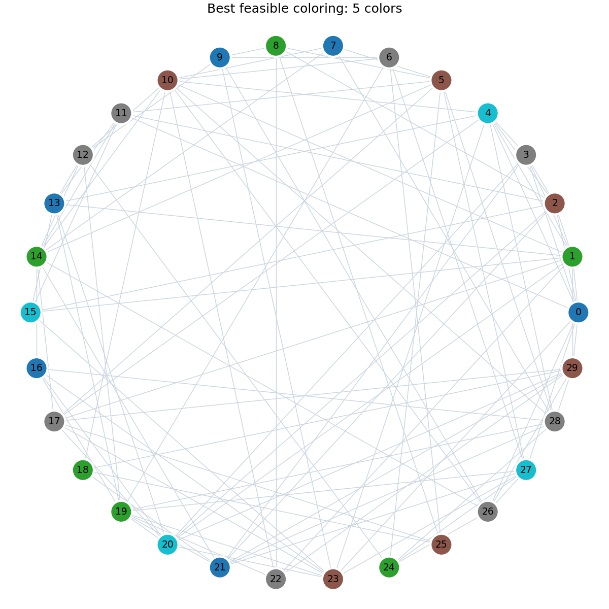

# Лабораторная работа № 2

## Генетический алгоритм для дискретной задачи с ограничениями

**Дисциплина:** «Эволюционное программирование и генетические алгоритмы»  
**Группа:** 507  
**Номер студента:** 17  
**Год:** 2026  
**Индивидуальный вариант:** 16 — раскраска графа с минимизацией числа цветов и штрафом за конфликты.

---

## 1. Постановка задачи и индивидуальный вариант

В лабораторной работе рассматривается задача раскраски неориентированного графа.

Дан граф, состоящий из 30 вершин и набора рёбер между ними. Для каждой вершины необходимо выбрать цвет так, чтобы две вершины, соединённые ребром, не имели одинаковый цвет.

Основная цель — получить **допустимую раскраску графа с минимально возможным числом цветов**.

Индивидуальному варианту № 16 соответствует задача:

> **Раскраска графа с минимизацией числа цветов и штрафом за конфликты.**

Для решения используется генетический алгоритм. В работе дополнительно сравниваются:

- два способа обработки ограничений;
- два варианта мутации;
- генетический алгоритм и простая жадная эвристика.

Входной граф является синтетическим и генерируется с фиксированным начальным значением генератора случайных чисел `2650717`, поэтому эксперимент можно полностью воспроизвести.

Первые пять вершин графа принудительно образуют полный подграф из пяти вершин. Следовательно, для их раскраски требуется как минимум пять различных цветов.

При этом при генерации графа известна допустимая раскраска в пять цветов. Поэтому для данного графа заранее известно точное оптимальное значение:

\[
\chi(G)=5.
\]

Это позволяет не только сравнивать методы между собой, но и проверять, удалось ли алгоритму найти глобально оптимальное решение.

---

## 2. Формальное описание пространства решений, целевой функции и ограничений

Пусть задан неориентированный граф

\[
G=(V,E),
\]

где:

- \(V\) — множество вершин;
- \(E\) — множество рёбер;
- \(|V|=30\).

Каждой вершине \(i\) назначается целое число \(c_i\), обозначающее её цвет:

\[
c_i \in \{0,1,\ldots,29\}.
\]

Таким образом, одно решение представляется вектором:

\[
c=(c_1,c_2,\ldots,c_{30}).
\]

### Ограничение допустимости

Для каждого ребра \((u,v)\in E\) должно выполняться:

\[
c_u \neq c_v.
\]

Если две соединённые ребром вершины имеют один цвет, возникает конфликт.

Обозначим через \(C(c)\) количество конфликтующих рёбер.

Для допустимой раскраски:

\[
C(c)=0.
\]

### Основная цель

Обозначим через \(K(c)\) количество различных цветов, используемых в решении.

Необходимо минимизировать:

\[
K(c).
\]

То есть требуется использовать как можно меньше цветов, не нарушая ограничений графа.

### Целевая функция со штрафом

Для варианта алгоритма, в котором недопустимые решения разрешено временно сохранять в популяции, используется функция:

\[
F(c)=K(c)+31\cdot C(c).
\]

Алгоритм минимизирует значение \(F(c)\).

Коэффициент штрафа 31 выбран потому, что в графе всего 30 вершин. Следовательно, любая допустимая раскраска использует не более 30 цветов и имеет значение целевой функции не более 30.

Если присутствует хотя бы один конфликт, то значение штрафной функции становится больше 30. Поэтому любое решение с конфликтом автоматически считается хуже любого допустимого решения.

---

## 3. Представление особи: генотип, фенотип и декодирование

В генетическом алгоритме каждая особь представляет один вариант раскраски графа.

### Генотип

Генотип — это целочисленный вектор длины 30:

```text
[0, 1, 2, 3, 4, 0, 2, ...]
```

Позиция в векторе соответствует номеру вершины, а значение — номеру назначенного ей цвета.

Например:

```text
[0, 1, 0, 2]
```

означает:

- вершина 0 имеет цвет 0;
- вершина 1 имеет цвет 1;
- вершина 2 имеет цвет 0;
- вершина 3 имеет цвет 2.

### Фенотип

Фенотип — это содержательная раскраска графа, то есть разбиение вершин на группы одинакового цвета.

Для примера выше:

- цвет 0: вершины 0 и 2;
- цвет 1: вершина 1;
- цвет 2: вершина 3.

Дополнительного сложного декодирования не требуется: генотип напрямую задаёт цвет каждой вершины.

### Нормализация номеров цветов

Номера цветов сами по себе не имеют смысла.

Например:

```text
[0, 0, 1, 1]
```

и

```text
[1, 1, 0, 0]
```

описывают одну и ту же структуру раскраски.

Поэтому в программе используется перенумерация цветов по порядку их первого появления. Это позволяет привести эквивалентные раскраски к одинаковому виду и уменьшить количество искусственно различных решений.

### Примеры допустимых и недопустимых решений

В файле `results/examples.json` сохранены два допустимых и два недопустимых решения.

Примеры допустимых решений:

1. известная пятицветная раскраска, построенная при генерации графа;
2. раскраска, в которой каждая вершина имеет собственный цвет.

Второй вариант не является хорошим по числу цветов, но он гарантированно допустим, потому что соседние вершины всегда имеют разные цвета.

Примеры недопустимых решений:

1. всем вершинам назначен один цвет;
2. известная допустимая раскраска специально изменена так, чтобы внутри полного подграфа из пяти вершин появился конфликт.

Таким образом, программа различает корректность самого представления решения и допустимость решения относительно ограничений графа.

---

## 4. Описание эволюционного алгоритма, операторов и параметров

Для каждого независимого запуска создаётся начальная популяция случайных раскрасок.

Далее алгоритм выполняет 100 поколений.

В каждом поколении выполняются следующие действия:

1. выбор родительских особей;
2. скрещивание;
3. мутация;
4. при необходимости — исправление конфликтов;
5. оценка полученных решений;
6. формирование следующего поколения;
7. сохранение лучшей особи.

### Основные параметры

| Параметр | Значение |
|---|---:|
| Размер популяции | 72 |
| Число поколений | 100 |
| Число независимых запусков | 20 |
| Начальные значения генератора | 27000–27019 |
| Вероятность скрещивания | 0.9 |
| Вероятность мутации вершины | 0.15 |
| Размер турнира при отборе | 3 |
| Число сохраняемых лучших особей | 1 |
| Коэффициент штрафа | 31 |

За один запуск одного варианта генетического алгоритма выполняется:

\[
72\cdot(100+1)=7272
\]

оценки решений.

### Отбор родителей

Используется турнирный отбор.

Случайно выбираются три особи, после чего родителем становится лучшая из них.

Такой способ позволяет чаще использовать хорошие решения, но при этом не ограничивает размножение только одной или несколькими лучшими особями.

### Скрещивание

Используется равномерное скрещивание.

Для каждой вершины независимо выбирается, от какого из двух родителей потомок получит значение цвета.

Вероятность применения скрещивания равна 0.9.

Такое скрещивание подходит для выбранного представления, потому что каждый элемент вектора непосредственно соответствует одной вершине графа.

### Мутация

В работе сравниваются два варианта мутации.

#### 1. Случайное изменение цвета (`reset`)

С некоторой вероятностью вершине назначается случайный цвет.

При этом может быть использован как уже существующий цвет, так и новый.

Такой оператор увеличивает разнообразие популяции и позволяет алгоритму исследовать новые варианты раскраски.

#### 2. Копирование существующего цвета (`copy`)

Вершина получает цвет другой случайно выбранной вершины.

В этом случае новый цветовой класс не создаётся: алгоритм перераспределяет вершины между уже существующими цветами.

Такой оператор потенциально способствует уменьшению количества используемых цветов.

---

## 5. Способы обработки ограничений

В работе сравниваются два принципиально разных подхода.

### 5.1. Штраф за конфликты

В первом варианте конфликтующие решения не исправляются.

Они остаются в популяции, но получают большое значение целевой функции:

\[
F(c)=K(c)+31C(c).
\]

Чем больше конфликтов, тем хуже считается решение.

Преимущество этого подхода состоит в том, что алгоритм может свободно исследовать всё пространство решений.

Недостаток — значительная часть вычислений может тратиться на недопустимые раскраски.

### 5.2. Исправление конфликтов

Во втором подходе после создания новой особи конфликтующая раскраска исправляется.

Вершины рассматриваются по убыванию степени, то есть сначала обрабатываются вершины с большим числом соседей.

Если текущий цвет вершины конфликтует с цветом одного из соседей, вершине назначается минимальный свободный цвет, не используемый её соседями.

После завершения этой процедуры получается допустимая раскраска.

Преимущество состоит в том, что генетический алгоритм далее работает только с допустимыми решениями.

Недостаток — процедура исправления сама изменяет особь и может увеличить количество используемых цветов.

---

## 6. Блок-схема алгоритма



Таким образом, различия исследуемых вариантов алгоритма находятся только в способе обработки ограничений и в операторе мутации. Остальные параметры остаются одинаковыми, что делает сравнение более корректным.

---

## 7. Обоснование выбора операторов относительно структуры задачи

Выбранное представление напрямую отражает структуру задачи: каждой вершине соответствует один элемент целочисленного вектора.

Поэтому при скрещивании и мутации можно изменять цвета отдельных вершин, не нарушая длину или формат решения.

Равномерное скрещивание позволяет потомку получить части раскраски сразу от двух родителей.

Случайная мутация цвета полезна для исследования новых вариантов, так как способна создавать новые цветовые классы.

Мутация копированием, наоборот, использует только существующие цвета. Поэтому она лучше соответствует задаче минимизации числа цветовых классов: перенос вершины в уже существующий класс потенциально позволяет отказаться от лишнего цвета.

Процедура исправления конфликтов также учитывает структуру графа. Сначала рассматриваются вершины с большим числом соседей, поскольку именно для них подобрать допустимый цвет обычно сложнее.

---

## 8. Проведение эксперимента и результаты независимых запусков

Для каждого метода выполнено 20 независимых запусков с начальными значениями генератора случайных чисел от `27000` до `27019`.

Сравниваются четыре метода:

| Обозначение в программе | Описание |
|---|---|
| `Penalty-reset` | штраф за конфликты + случайное изменение цвета |
| `Repair-reset` | исправление конфликтов + случайное изменение цвета |
| `Repair-copy` | исправление конфликтов + копирование существующего цвета |
| `Random-greedy` | жадное построение раскраски в случайном порядке |

Первые три метода относятся к исследованию генетического алгоритма.

Последний метод используется как простой алгоритм сравнения.

Для него в каждом запуске также выполняется 7272 независимых построения раскраски, чтобы число рассматриваемых решений было сопоставимо с числом оценок в генетическом алгоритме.

Кроме этого, измеряется фактическое время выполнения, поскольку одна оценка генетического алгоритма и одно полное жадное построение имеют разную вычислительную стоимость.

### Итоговая статистика

Все лучшие итоговые решения, полученные исследуемыми методами, являются допустимыми.

| Метод | Лучший результат | Среднее | Медиана | Стандартное отклонение | Худший результат | Среднее время, с |
|---|---:|---:|---:|---:|---:|---:|
| Штраф + случайная мутация | 9 | 10.50 | 10.5 | 0.945905 | 12 | 0.3228 |
| Исправление + случайная мутация | 6 | 6.05 | 6 | 0.223607 | 7 | 0.6788 |
| Исправление + копирование цвета | **5** | **5.95** | 6 | 0.223607 | 6 | 0.6422 |
| Жадный алгоритм | **5** | **5.00** | **5** | **0** | **5** | 0.4711 |

Для данной задачи меньшее число цветов означает лучший результат.

Точное оптимальное значение известно заранее и равно 5.

### График сходимости



### Лучшая найденная допустимая раскраска



Полные результаты каждого запуска сохранены в файле `results/runs.csv`.

---

## 9. Анализ результатов и влияние выбранных операторов

### Влияние способа обработки ограничений

Наиболее заметная разница наблюдается между использованием только штрафа и предварительным исправлением конфликтующих решений.

При использовании штрафа средний результат составил:

\[
10.5
\]

цвета.

После добавления процедуры исправления конфликтов при той же мутации среднее значение уменьшилось до:

\[
6.05.
\]

Это означает, что на рассматриваемом графе исправление недопустимых решений оказалось значительно эффективнее, чем сохранение конфликтующих решений с большим штрафом.

Причина состоит в том, что при использовании только штрафа алгоритм тратит часть популяции и вычислений на решения, которые всё равно нельзя использовать как итоговую раскраску.

Процедура исправления сразу возвращает особь в область допустимых решений, после чего алгоритм может заниматься основной задачей — уменьшением количества цветов.

### Влияние оператора мутации

При одинаковом способе исправления конфликтов получены следующие средние значения:

- случайное изменение цвета — 6.05;
- копирование существующего цвета — 5.95.

Мутация копированием показала немного лучший результат.

Это соответствует её смыслу: она не создаёт новый цвет, а пытается использовать уже существующие цветовые классы.

Однако разница составляет всего 0.1 цвета, поэтому по 20 запускам нельзя утверждать, что данный оператор всегда будет лучше на любых графах.

Можно сделать только более осторожный вывод: **на исследуемом графе копирование существующего цвета оказалось немного эффективнее случайного назначения цвета**.

### Сравнение с жадным алгоритмом

Простая жадная эвристика во всех 20 запусках получила решение из пяти цветов.

Поскольку известно, что меньше пяти цветов для данного графа использовать невозможно, жадный алгоритм каждый раз находил глобальный оптимум.

Лучший вариант генетического алгоритма — исправление конфликтов с копированием цвета — также смог найти решение из пяти цветов, но только в одном из запусков. В остальных случаях результат составлял шесть цветов.

Следовательно, на данном конкретном графе генетический алгоритм не превосходит простой конструктивный метод.

Это не является ошибкой эксперимента. Напротив, сравнение показывает, что применение более сложного эволюционного метода не гарантирует преимущества для любой задачи.

---

## 10. Почему полученный результат следует считать хорошим, приемлемым или недостаточным

Работу генетического алгоритма можно считать **приемлемой, но не наилучшей для данного графа**.

Положительным результатом является то, что лучший вариант генетического алгоритма смог найти глобально оптимальную раскраску из пяти цветов.

Кроме того, эксперимент показал сильное влияние выбранного способа обработки ограничений:

- использование только штрафа привело в среднем к 10.5 цветам;
- исправление конфликтов уменьшило средний результат примерно до шести цветов.

То есть изменение способа обработки ограничений существенно улучшило работу генетического алгоритма.

Однако устойчивость результата остаётся недостаточной. Оптимум был найден генетическим алгоритмом только в одном запуске, тогда как жадный алгоритм получал пять цветов во всех 20 запусках.

Поэтому для данного конкретного графа наиболее рациональным является использование простой жадной эвристики.

При этом данный вывод нельзя автоматически переносить на все задачи раскраски графов. Эксперимент проведён только на одном синтетическом графе. На графах другой структуры, размера и плотности соотношение результатов может измениться.

---

## 11. Итоговые выводы

В ходе лабораторной работы был реализован генетический алгоритм для задачи раскраски графа с минимизацией числа используемых цветов.

По результатам эксперимента можно сделать следующие выводы:

1. Целочисленный вектор является естественным представлением решения, поскольку каждый элемент напрямую задаёт цвет одной вершины.

2. Способ обработки ограничений существенно влияет на качество результата. Исправление конфликтующих решений показало значительно лучший результат, чем использование только штрафной функции.

3. Мутация копированием существующего цвета дала немного лучшее среднее значение, чем случайное назначение цвета, однако разница между операторами невелика.

4. Лучший вариант генетического алгоритма смог найти известный глобальный оптимум — пять цветов.

5. На данном графе простая жадная эвристика оказалась устойчивее генетического алгоритма и находила оптимум во всех 20 независимых запусках.

6. Следовательно, усложнение алгоритма само по себе не гарантирует улучшения результата. Эффективность метода зависит от структуры конкретной оптимизационной задачи.

---

## 12. Ограничения эксперимента

Основным ограничением работы является то, что эксперимент проведён на одном синтетическом графе.

Для более полного исследования можно было бы дополнительно:

- проверить алгоритмы на нескольких графах различной плотности;
- увеличить размер графа;
- исследовать влияние размера популяции и вероятности мутации;
- сравнить результаты с более сильными алгоритмами раскраски;
- использовать специализированные локальные преобразования раскраски.

В рамках требований лабораторной работы проведённого эксперимента достаточно для сравнения способов обработки ограничений и операторов мутации.

---

## 13. Воспроизводимость эксперимента

Параметры проведённого эксперимента:

```json
{
  "population": 72,
  "generations": 100,
  "runs": 20,
  "first_seed": 27000,
  "mutation_probability": 0.15,
  "penalty": 31,
  "crossover_probability": 0.9,
  "group": 507,
  "student_number": 17,
  "year": 2026,
  "variant": 16
}
```

Основные файлы проекта:

- `data/graph.json` — входной граф;
- `config.json` — параметры эксперимента;
- `model.py` — реализация задачи и основных операторов;
- `main.py` — запуск эксперимента;
- `results/runs.csv` — результаты отдельных запусков;
- `results/summary.csv` — итоговая статистика;
- `results/examples.json` — примеры допустимых и недопустимых решений;
- `results/convergence.png` — график сходимости;
- `results/coloring.png` — изображение лучшей найденной раскраски.

Все начальные значения генератора случайных чисел зафиксированы, поэтому результаты эксперимента можно воспроизвести.
