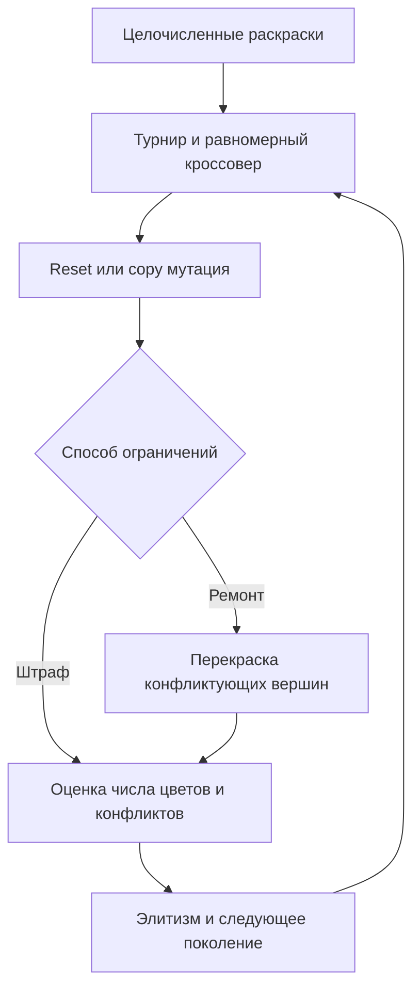

# Лабораторная работа № 2

## Раскраска графа · ограничения и операторы

**Дисциплина:** «Эволюционное программирование и генетические алгоритмы»  
**Группа:** 507 · **номер студента:** 17 · **год:** 2026  
**Вариант:** `V = 1 + ((17 × 17 + 7 × 0 + 26) mod 20) = 16`.

Основание — предоставленный комплекс лабораторных работ Р. В. Душкина, разделы 1.2–1.5 и соответствующее задание. ФИО не указано, вымышленные данные не добавлялись. Все ключевые эволюционные операторы реализованы в исходниках без готовых оптимизаторов.

## 1. Постановка и данные

Неориентированный простой граф $G=(V,E)$ содержит 30 вершин. Требуется раскраска $c_i\in\{0,\ldots,29\}$, минимизирующая число использованных цветов $K(c)$, при $c_u\ne c_v$ для каждого ребра. Генотип — целочисленный вектор, фенотип — разбиение вершин на цветовые классы. Метки цветов канонизируются по первому появлению, что уменьшает нейтральные различия между эквивалентными раскрасками.

Генерация: seed 2650717, скрытые классы `i mod 5`; рёбра добавляются только между различными классами с вероятностью 0.28. Первые пять вершин принудительно образуют клику. Список рёбер и известная допустимая раскраска приложены в `data/graph.json`, генератор — `model.generate`. Клика $K_5$ даёт нижнюю границу 5, известная раскраска — верхнюю 5. Следовательно, **хроматическое число строго равно 5**. Известная раскраска служит только проверкой и не используется операторами ГА.

## 2. Ограничения и операторы

Целевая оценка: $F(c)=K(c)+31\,C(c)$, где $C$ — число конфликтующих рёбер. Все значения минимизируются. Любое допустимое решение имеет $F\le30$, любое конфликтующее — $F\ge32$; штраф гарантированно отделяет допустимость от качества. Это не означает, что все оценённые кандидаты будут допустимы.

Сравниваются четыре метода:

| Метод | Ограничения | Мутация |
|---|---|---|
| Penalty-reset | Только штраф | Случайный цвет, в том числе новый |
| Repair-reset | Последовательная перекраска конфликтов | Та же reset |
| Repair-copy | Тот же ремонт | Перенос вершины в существующий цветовой класс |
| Random-greedy | Жадная раскраска в случайном порядке | Независимое построение |

Селекция — турнир из 3; равномерный кроссовер с вероятностью 0.9; вероятность мутации вершины 0.15; одна элита. Reset выбирает цвет из диапазона `0..max_color+1`, copy копирует класс случайной вершины. Эти мутации содержательно различаются: reset может открыть новый класс, copy объединяет/перераспределяет существующие.

Ремонт обходит вершины по убыванию степени. Если цвет конфликтует с соседом, назначает минимальную свободную метку. Он всегда завершается допустимой раскраской: новый цвет отличается от цветов **всех** текущих соседей; последующие перекраски также не создают ребро с одинаковыми цветами. Требуется не больше 30 цветов. Ремонт может ухудшить количество цветов, поэтому это не точный оптимизатор.



## 3. Примеры и эксперимент

Два допустимых и два недопустимых вектора полностью записаны в `results/examples.json`: `i mod 5`, уникальный цвет каждой вершины, все нули, а также известная раскраска с конфликтом внутри клики. Недопустимость здесь относится к рёбрам, все векторы имеют корректную длину и диапазон меток.

72 особи, 100 поколений, **7272 оценки на метод и seed**, 20 seed 27000–27019. Сравнение `Penalty-reset`/`Repair-reset` меняет только обработку ограничений; `Repair-reset`/`Repair-copy` — только мутацию. Baseline делает 7272 независимые жадные раскраски в случайном порядке. Его конструктивные шаги не равны стоимости мутации: поэтому дополнительно измеряется реальное время. Тот же аргумент относится к ремонту, чей внутренний обход рёбер не записывается как отдельная фитнес-оценка.


## 4. Анализ и ограничения

Все лучшие итоговые решения допустимы. При этом в режиме штрафа доля допустимых **оценённых кандидатов** мала; она отдельно сохранена в `runs.csv`. Поле `best_feasible_colors` относится только к найденным допустимым решениям. График использует штрафную оценку, поэтому сравнение первых поколений отражает также устранение конфликтов.

Жадная эвристика оказалась сильнее ГА: оптимум 5 найден в каждом запуске baseline. Repair-copy нашёл 5 цветов в одном запуске, обычно получая 6; Repair-reset обычно получает 6, а штрафный режим заметно хуже. Это содержательный отрицательный результат: на этом экземпляре нет основания рекомендовать ГА вместо конструктивного метода. Ремонт улучшает поиск по сравнению со штрафом, а копирование класса немного снижает среднее число цветов. Разница двух мутаций мала и не доказывает универсального превосходства.

Для проверки глобальности здесь есть строгий сертификат — клика из пяти вершин. Для произвольного графа такой сертификат заранее не известен. Ограничение эксперимента — один синтетический граф с искусственно заданной 5-раскрашиваемостью. Продолжение: серия графов разных плотностей, DSATUR как более сильный baseline, операторы обмена Кемпе и локальный поиск.

## Численные результаты выполненной серии


Минимум и максимум — значения метрики, направление оптимизации см. в отчёте. Стандартное отклонение выборочное (ddof=1). Полоса на графике — min–max, не доверительный интервал.

| Метод | Запусков | Минимум | Среднее | Медиана | Std | Максимум | Время, с |
|---|---:|---:|---:|---:|---:|---:|---:|
| Penalty-reset | 20 | 9 | 10.5 | 10.5 | 0.945905 | 12 | 0.3228 |
| Repair-reset | 20 | 6 | 6.05 | 6 | 0.223607 | 7 | 0.6788 |
| Repair-copy | 20 | 5 | 5.95 | 6 | 0.223607 | 6 | 0.6422 |
| Random-greedy | 20 | 5 | 5 | 5 | 0 | 5 | 0.4711 |

## Полная конфигурация

```json
{
  "population": 72,
  "generations": 100,
  "runs": 20,
  "first_seed": 27000,
  "mutation_probability": 0.15,
  "penalty": 31,
  "crossover_probability": 0.9,
  "group": 507,
  "student_number": 17,
  "year": 2026,
  "variant": 16
}
```
